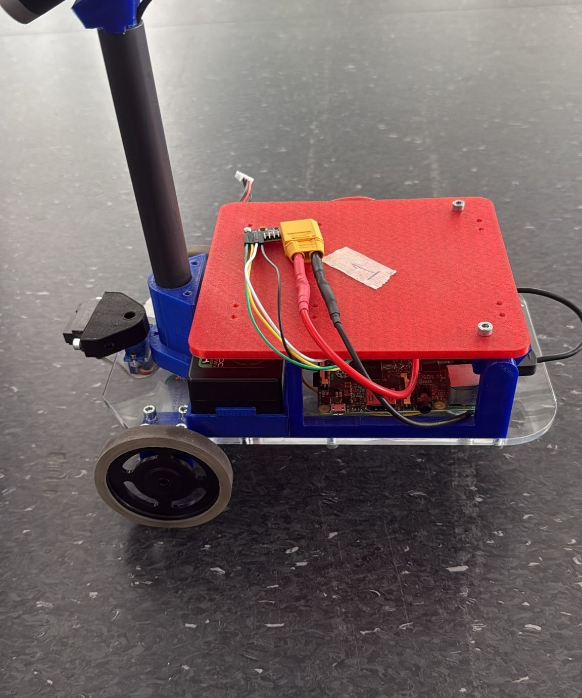

# Autonomous Maze Rover

This repository is the public code companion for the bachelor thesis:

**Applying Different Path Planning Algorithms to a Mini Mars Rover for an Uncharted Maze**

The project investigates whether a pre-built Mini Mars Rover with constrained hardware can autonomously explore an unknown maze, build an internal map, and then solve the maze using multiple path-planning algorithms.



## Thesis

- Published thesis: https://opus4.kobv.de/opus4-rhein-waal/frontdoor/index/index/start/0/rows/10/sortfield/score/sortorder/desc/searchtype/simple/query/egehan+usluer/docId/2277
- Author: Egehan Usluer
- Institution: Hochschule Rhein-Waal, Faculty of Technology and Bionics
- First supervisor: Prof. Dr. Ronny Hartanto
- Second supervisor: M. Sc. Thomas Grunenberg
- Submission date: 14 August 2025

## Project Scope

The work combines simulation and real-hardware testing around a Mini Mars Rover platform.

Main topics covered in the thesis and in this repository:

- low-level rover control with Arduino Due firmware
- Raspberry Pi based high-level navigation logic
- wheel-encoder odometry and heading tracking
- IR-based wall detection
- IMU-based heading estimation and correction
- maze exploration in known and unknown settings
- path planning with Flood Fill, Dijkstra, and A*
- simulation for comparing exploration behavior before hardware execution

The main question is not only whether these algorithms work in theory, but how well they can be adapted to a small rover under real constraints such as drift, noisy sensing, calibration issues, and motion irregularities.

## System Architecture

The project is split between two processing units:

- the Arduino Due handles low-level motor actuation, encoder counting, servo control, and sensor-side I2C responses
- the Raspberry Pi 2 Model B runs the higher-level Python logic for localization, heading estimation, exploration, map handling, path planning, and execution flow

The two boards communicate over I2C. The Raspberry Pi acts as the master and sends motion or servo commands, while the Arduino returns the sensor packet used by the Python side. That packet includes IR distance, wheel encoder values, and a stop flag used when the rover detects an obstacle close to the chassis.

## Repository Structure

```text
autonomous-maze-rover/
|-- assets/
|-- data/
|   `-- maps/
|-- firmware/
|   `-- arduino_due/
|-- src/
|   |-- config/
|   |-- control/
|   |-- exploration/
|   |-- fusion/
|   |-- navigation/
|   `-- sensors/
|-- LICENSE
|-- README.md
`-- requirements.txt
```

## Code Layout

- `src/control/` contains low-level Python-side motion logic, odometry, and movement control helpers
- `src/sensors/` contains IMU heading estimation and filtering
- `src/fusion/` contains heading fusion utilities
- `src/exploration/` contains maze exploration logic and the simulation environment
- `src/navigation/` contains maze-solving and path-execution logic
- `firmware/arduino_due/` contains Arduino Due code for motor control and communication
- `data/maps/` contains maze data used during planning and testing

## Algorithms Used

### Exploration

- Modified BFS with TSP-inspired nearest-frontier selection
- POMDP-inspired frontier scoring with travel cost

### Path Planning

- Flood Fill
- Dijkstra
- A* with Manhattan heuristic

## How It Works

### Odometry and Localization

The rover estimates its pose from wheel-encoder readings using a differential-drive odometry model on the Raspberry Pi side. Encoder values are read as cumulative wheel rotations, converted into traveled distance, and then translated into position and heading updates in a local 2D reference frame.

The coordinate convention used in the thesis and code is:

- `+y` as forward
- `+x` as left
- negative `x` as right
- heading measured relative to the forward axis

Two motion cases are used during odometry updates:

- nearly straight motion, where the robot advances without a meaningful heading change
- arc motion, where the rover turns and the pose update follows the differential-drive curvature

This gives continuous relative localization, but it also accumulates drift over time.

### IMU Heading Correction

An MPU6500 IMU is used to improve heading estimation and reduce the practical effect of odometry drift during turns and forward steps. The IMU is connected directly to the Raspberry Pi on a separate I2C bus and is initialized, calibrated, and updated from the Python side.

The implementation:

- calibrates gyroscope offsets before tracking
- runs a background heading-update thread
- uses Madgwick and Mahony-style filtering logic without a magnetometer
- converts the resulting yaw into the rover heading convention used by the rest of the software

In practice, the IMU is used mainly for heading stabilization rather than as a full replacement for odometry.

### Low-Level Motion and Obstacle Detection

The Arduino firmware handles forward, backward, and rotational motion commands, while the Raspberry Pi decides when those commands should be issued. Forward motion is supported by a PI controller to keep both wheels moving consistently despite small hardware asymmetries.

For obstacle detection, the rover uses an IR distance sensor mounted on a servo:

- the raw IR measurements are filtered before use
- obstacle confirmation requires repeated low-distance readings
- the stop flag is exposed to the Raspberry Pi through the I2C response packet

The project also includes an experimental vision-based path, but the practical solution used in the thesis relies mainly on the IR sensor.

### Exploration

The exploration phase is responsible for discovering the maze before path execution. In hardware mode, the rover scans the local walls with the servo-mounted IR sensor, updates the internal map, identifies frontier cells, and selects the next exploration target.

The repository includes two exploration strategies:

- a modified BFS with a nearest-frontier, TSP-inspired selection rule
- a lightweight POMDP-inspired frontier scoring method that trades off exploration value, travel cost, and elapsed steps

Both follow the same high-level loop:

- scan walls
- update the maze model
- update the frontier set
- choose a target frontier
- plan a route to it
- move and repeat

### Mapping Logic

The maze is represented internally as a grid where each cell stores wall information in the four cardinal directions in the order `[N, E, S, W]`. This representation is used by both the exploration and path-planning code.

The software supports two mapping modes:

- known-size mode, where the maze dimensions are given in advance
- unknown-size mode, where an oversized internal array is used and the explored area grows around an offset-centered starting position

As the robot senses its surroundings, the corresponding wall states are written into the grid and neighboring cell boundaries are updated consistently. The same map is then reused for continued exploration and later path planning.

### Path Planning and Execution

Once a map is available, the rover plans a route from its current cell to a selected target cell using Flood Fill, Dijkstra, or A*. The path planner operates on the grid representation and checks whether adjacent moves are valid based on the wall bits stored in the map.

The resulting path is converted into motion commands step by step:

- orient toward the next cell using the current estimated heading
- rotate if the IMU heading error is large enough
- move forward toward the next cell center
- check the pose again after the movement
- apply post-move heading correction if necessary

If the robot drifts from the expected cell, encounters a blocked transition, or repeatedly fails to advance correctly, replanning can be triggered from the current estimated cell.

### Simulation vs Hardware

The repository includes both simulation and real-hardware logic. The simulation is useful for comparing exploration behavior, testing frontier logic, and observing path behavior without physical constraints. It models cell movement, drift, orientation noise, and exploration statistics.

The hardware implementation deals with noise, motion irregularities, drift, calibration, timing sensitivity, and sensor limitations on a real rover platform. The gap between algorithmic behavior in simulation and real behavior on hardware is one of the main themes of the thesis.

## Hardware Overview

The implementation is built around:

- Arduino Due for low-level actuation and sensor communication
- Raspberry Pi 2 Model B for higher-level logic
- wheel encoders for odometry
- an IR distance sensor mounted on a servo for wall detection
- an added MPU6500 IMU for heading estimation and correction

The project also includes an experimental camera-based obstacle-detection path, but the practical implementation relies mainly on the IR sensor and motion-state feedback.

## Python Environment

Install the Python dependencies with:

```bash
pip install -r requirements.txt
```

Notes:

- The Python code uses `numpy` and `matplotlib`.
- Hardware execution also depends on an `smbus` implementation, which is typically installed at the OS level on Raspberry Pi environments.

## Running the Project

Typical entry points in the current tree are:

- `src/exploration/simulation.py` for simulation-based exploration experiments
- `src/exploration/explore.py` for hardware exploration
- `src/navigation/solver.py` for hardware path planning and execution

Run examples:

```bash
python -m src.exploration.simulation
python -m src.exploration.explore
python -m src.navigation.solver
```

## Reproducibility and Scope

This repository is intended as the public software companion to the thesis, not as a full hardware replication package.

- The Mini Mars Rover platform used in the thesis was an already existing lab robot, not a platform designed and manufactured entirely within this repository.
- The software, firmware, algorithm integration, simulation code, and project structure developed for the thesis are included here.
- Full mechanical design files, PCB production files, and complete hardware manufacturing documentation are not included in this public repository.
- Hardware-specific scripts may require the original rover setup, calibration, and compatible electronics to run correctly.

For readers without access to the rover hardware, the repository is still useful for:

- studying the control, localization, exploration, and planning code
- reviewing the software architecture used in the thesis
- inspecting the simulation-side implementation
- understanding how the algorithms were adapted to a constrained robot platform

## Media

Use `assets/` for repository media:

- place images and screenshots in `assets/images/`

If videos are large, prefer GitHub Releases, YouTube, Google Drive, or Git LFS instead of committing large binaries directly into normal git history.

## Notes

- This repository reflects the thesis implementation prepared for public reference.
- Simulation and hardware behavior are both part of the project and should not be treated as interchangeable.
- Some code paths are hardware-specific and are intended to run only on the rover setup or an equivalent environment.

## License

This project is distributed under the MIT License. See `LICENSE` for details.
